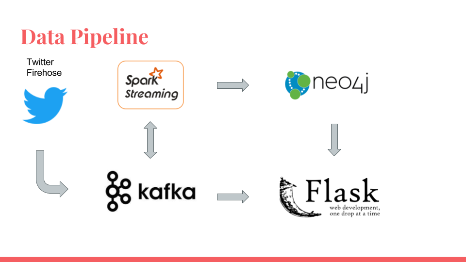

# TopicMatch

TopicMatch is a distributed data pipeline for topic clustering on streaming text data -- a fellowship project as an Insight Data Engineering fellow for Summer 2017. All clusters utilize open source software and are housed on AWS.

# Dependencies
  1. Pegasus (https://github.com/InsightDataScience/pegasus)
  2. Apache Kafka (Kafka-python - http://kafka-python.readthedocs.io/en/master/install.html)
  3. Spark Streaming (Pyspark - https://spark.apache.org/docs/latest/streaming-programming-guide.html)
  4. Neo4j (https://neo4j.com/download/)
  5. Mazerunner (https://github.com/neo4j-contrib/neo4j-mazerunner)
  6. Flask (http://flask.pocoo.org/)

* 

# Pipeline
  1. Twitter data producers compiled from a static bank of ~3 million tweet JSON objects saved in S3. 
  2. Data is funneled into Kafka through producers at about ~10,000 JSON objects per second.
  3. Kafka cluster has 3 nodes -- distributing ingestion and controlling throughput for constant data production volume.
  4. Spark Streaming consumes from the Kafka cluster with 1 master/3 workers and pre-processes/aggregates tweets. 
  5. Spark Streaming outputs are directed back to Kafka as a central broker which are consumed through batch Neo4j Cypher queries for          graphDB storage. Overall tweet counts and trending hashtags are delivered straight to Flask from Kafka for dashboard visualization.
  6. Neo4j processes the latest 1 minute window of graph data to isolate clusters through triangle counting in Mazerunner (Neo4j-Spark          GraphX connector).
  
